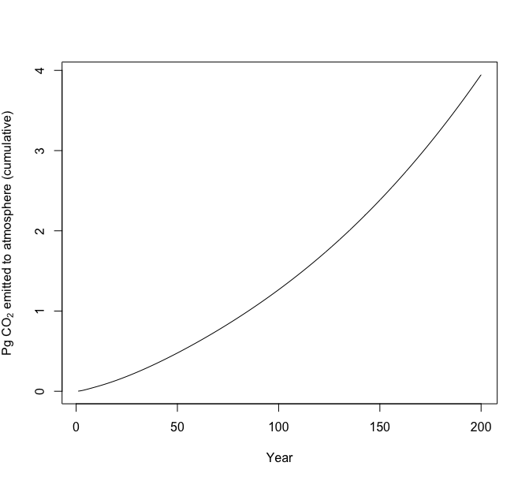

# global-trawling-CO2
Code and data for refinement of the benthic trawling CO2 emissions estimate originally presented in [Sala et al., 2021. Protecting the global ocean for biodiversity, food and climate. *Nature* **592**, 397–402](https://doi.org/10.1038/s41586-021-03371-z). We intend to present the reanalysis contained in this repository as a Matters Arising comment to the same journal. Calculations and data pertaining to other animal-mediated ocean carbon fluxes, including an analysis of the possible climate impacts from new benthic trawling in the emerging Arctic and support for a review (in prep) of zoogeochemical carbon fluxes in the ocean, are in [this repository](https://github.com/jamesrco/zoonotic-C).

### Raw, unmodified data and files

* The files in [data/global_trawling/raw/sala_et_al_2021](data/global_trawling/raw/sala_et_al_2021) are from [Sala et al., 2021. Protecting the global ocean for biodiversity, food and climate. *Nature* **592**, 397–402](https://doi.org/10.1038/s41586-021-03371-z). Data files were retrieved from https://doi.org/10.25349/D9N89M on June 6, 2022. Resolution of the CO2 flux dataset (in [co2_efflux.tif]((data/global_trawling/raw/sala_et_al_2021/co2_efflux.tif)) is 1 km2. Resolution of both of the other two trawling-related datasets ([bottom_trawling_Ia.tif](data/global_trawling/raw/sala_et_al_2021/bottom_trawling_Ia.tif) and [carbon_ranking.tif](data/global_trawling/raw/sala_et_al_2021/carbon_ranking.tif) is 50 km2.)

* The files in [data/global_trawling/raw/FMI_world_EEZ_boundaries_v11](data/global_trawling/raw/FMI_world_EEZ_boundaries_v11) represent version 11 of the Flanders Marine Institute's global exclusive economic zone (EEZ) dataset. Data files were retrieved from https://www.vliz.be/en/imis?dasid=6316&doiid=386 on August 4, 2022.

* The GeoTIFF in [data/global_trawling/raw/SRTM30_PLUS_v8](data/global_trawling/raw/SRTM30_PLUS_v8) is version 8 of the SRTM30 digital elevation model, a 1-km resolution global DEM that includes ocean bathymetry. Retrieved from https://nextcloud.eatlas.org.au/apps/sharealias/a/world_e-atlas-ucsd_srtm30-plus_v8-tif on August 5, 2022. The SRTM30 DEM is described here: https://eatlas.org.au/data/uuid/80301676-97fb-4bdf-b06c-e961e5c0cb0b 

* The files "fseq_OCIM2_48L.mat" and "fseq_OCIM2_48L.nc" in [data/global_trawling/raw/siegel_et_al_2021_v2](data/global_trawling/raw/siegel_et_al_2021_v2) are from [Siegel et al., 2021. Assessing the sequestration time scales of some ocean-based carbon dioxide reduction strategies. *Environ. Res. Lett.* **16** 104003](https://iopscience.iop.org/article/10.1088/1748-9326/ac0be0#erlac0be0s5). The files contain the same data in MATLAB and NetCDF formats and were retrieved from https://doi.org/10.6084/m9.figshare.15228690.v2 on June 6, 2022. Per the published paper, model resolution is 2 degrees with 48 vertical levels. **Update: These files are not stored on GitHub due to size. User replicating this analysis will have to download the datasets from the figshare link and then move the files to the correct location.**

* The file "plot_sequestration_fraction.m" in [data/global_trawling/raw/siegel_et_al_2021_v2](data/global_trawling/raw/siegel_et_al_2021_v2) is the original, unmodified MATLAB script that Siegel et al. provided along with the data files containing the sequestration fractions. A modified version of this file, [global_trawling/gen_fracs_to_constrain_trawlCO2.m](global_trawling/gen_fracs_to_constrain_trawlCO2.m), was used to pull out the [necessary benthic sequestration fractions](data/global_trawling/derived/benthic_seqfractions) for the analysis using the [three R scripts in global_trawling](global_trawling/).

### Scripts

#### Shell scripts for AWS provisioning

* The shell scripts [still live here](https://github.com/jamesrco/zoonotic-C/tree/main/aws_provisioning). 

#### Global benthic trawling reanalysis

* The R and MATLAB scripts  [global_trawling/01_ConstrainCO2Flux_genSiegelMetaData.m](global_trawling/01_ConstrainCO2Flux_genSiegelMetaData.m), [global_trawling/02_ConstrainCO2Flux_IO.R](global_trawling/02_ConstrainCO2Flux_IO.R), [global_trawling/03_ConstrainCO2Flux_coordMatch.R](global_trawling/03_ConstrainCO2Flux_coordMatch.R), [global_trawling/04_ConstrainCO2Flux_genTrawlSeqFracs.m](global_trawling/04_ConstrainCO2Flux_genTrawlSeqFracs.m), [global_trawling/05_ConstrainCO2Flux_adjFlux_extended.R](global_trawling/05_ConstrainCO2Flux_adjFlux_extended.R), and [global_trawling/06_ConstrainCO2Flux_adjFlux_EEZs.R](global_trawling/06_ConstrainCO2Flux_adjFlux_EEZs.R) are the workhorse scripts for the benthic trawling reanalysis. They should be run in order, with the note that some of the `library()` calls and setting of working directory are repetitive. The R scripts assume that the objects generated in the previous scripts are still in the R environment.

### Outputs and derived data

* The files in [data/global_trawling/derived/benthic_seqfractions](data/global_trawling/derived/benthic_seqfractions) are the applicable sequestration fractions for the indicated year(s) plus necessary metadata, pulled from the [original Siegel et al. model output](data/global_trawling/raw/siegel_et_al_2021_v2) using the scripts [global_trawling/01_ConstrainCO2Flux_genSiegelMetaData.m](global_trawling/01_ConstrainCO2Flux_genSiegelMetaData.m) and [global_trawling/04_ConstrainCO2Flux_genTrawlSeqFracs.m](global_trawling/04_ConstrainCO2Flux_genTrawlSeqFracs.m). Individual .csv files contain the fractions for just the year indicated in the file name, while [fseq_bottom_multyears.mat](data/global_trawling/derived/benthic_seqfractions/fseq_bottom_multyears.mat) is a 3-D MATLAB array containing the fractions for years 1-200 in one-year increments, plus years 300-1000 in 100-year increments. [trawlYears.csv](data/global_trawling/derived/benthic_seqfractions/trawlYears.csv) is a list of the years represented in this 3-D array, corresponding to the 3rd dimension of the array.

* The files in [data/global_trawling/derived/output](data/global_trawling/derived/output) represent the outputs. Specifically:

    + [coord.matches.NonZero.RData](data/global_trawling/derived/output/coord.matches.NonZero.RData) is an R data object containing the indices (and corresponding coordinates) of the geographically closest data points in the Siegel et al. OCIM model output to the locations of the data points in the Sala et al. dataset which represent non-zero values of CO2 flux. These matches were generated using [03_ConstrainCO2Flux_coordMatch.R](global_trawling/03_ConstrainCO2Flux_coordMatch.R).
    
    + [Sala_et_al_trawlTiming_results.csv](data/global_trawling/derived/sala_et_al_2021_model/Sala_et_al_trawlTiming_results.csv) contains the "timing" output from the sediment disturbance model presented in the Sala et al. paper (remineralization of 1.47 Pg CO2 in the "first" year after commencement of trawling, declining to a steady rate of 0.58 Pg CO2 yr-1 at year 10 and beyond); this .csv file captures the values in the object `results` that is produced beginning on line 119 in [this script](https://github.com/emlab-ucsb/ocean-conservation-priorities/blob/master/ancillary_analyses/timing_of_trawling_impacts.Rmd).
    
    + [adjCO2efflux_global_PgCO2_yr.csv](data/global_trawling/derived/output/adjCO2efflux_global_PgCO2_yr.csv) contains adjusted global estimates of CO2 emissions to the atmosphere in a given year *n* following a one-time, 1.47 Pg remineralization of CO2 from sediment to bottom water in year 0 (as assumed by Sala et al.). For example, the results indicate that, after 1000 years, 0.49 Pg CO2 of the 1.47 Pg CO2 remineralized from carbon in sediment in year 0 will have reached the atmosphere. The quantity reaching the atmosphere is dramatically smaller for shorter time horizons. After just 100 years, only 0.046 Pg of the remineralized CO2 (about 3%) will have reached the atmosphere. 
    
    + [adjCO2efflux_global_PgCO2_cumulative.csv](data/global_trawling/derived/output/adjCO2efflux_global_PgCO2_cumulative.csv) contains cumulative global emissions estimates of CO2 to the atmosphere based on the pattern of trawling-related sediment disturbance posited by Sala et al. (remineralization of 1.47 Pg CO2 in the "first" year after commencement of trawling, declining to a steady rate of 0.58 Pg CO2 yr-1 at year 10 and beyond). For example, the analysis shows that after 100 years, a *cumulative* 1.27 Pg CO2 will have been emitted to the atmosphere if trawling indeed remineralizes carbon in sediments according to the hypothesized pattern, beginning at year 0. This cumulative 1.27 Pg CO2 is less than the 1.47 Pg CO2 Sala et al. suggested could be emitted in the first year of activity alone.
    
    
    **Figure 1.** Cumulative CO2 global emissions to the atmosphere through the indicated year, given a continuous pattern of trawling-related sediment disturbance beginning in year 0 according to the model described in Sala et al. (2021). Generated using the results in [adjCO2efflux_PgCO2_cumulative.csv](data/global_trawling/derived/output/adjCO2efflux_PgCO2_cumulative.csv).
